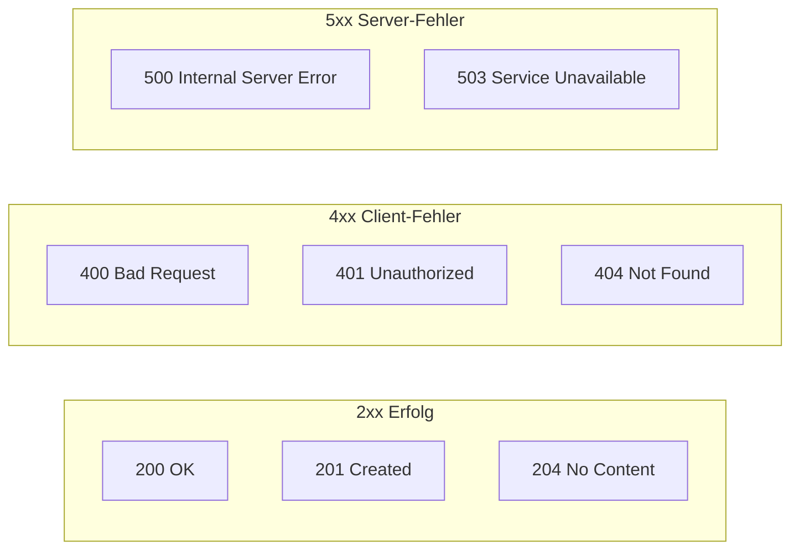

# HTTP - Hypertext Transfer Protocol

## Überblick

HTTP ist ein **zustandsloses Protokoll** für die Kommunikation im Web auf der Anwendungsschicht (Layer 5).

```
+------------------+                              +------------------+
|     CLIENT       |                              |     SERVER       |
|   (Browser)      |                              |   (Webserver)    |
+------------------+                              +------------------+
        |                                                  |
        |  ============= HTTP Request =============>       |
        |  GET /playlists?duration=300 HTTP/1.1            |
        |                                                  |
        |  <============ HTTP Response =============       |
        |  HTTP/1.1 200 OK                                 |
        |  [JSON Data]                                     |
        |                                                  |
```

## HTTP Request Aufbau

```
┌─────────────────────────────────────────────────────────────────┐
│ REQUEST LINE                                                     │
│ GET /playlists?duration=300 HTTP/1.1                            │
│ ↑    ↑                      ↑                                   │
│ │    │                      └── HTTP Version                    │
│ │    └── Ressourcenort (URI) mit Query Parameter                │
│ └── HTTP Methode                                                │
├─────────────────────────────────────────────────────────────────┤
│ HEADERS                                                          │
│ Host: playlist-server.com:8001                                  │
│ User-Agent: Mozilla/5.0                                         │
│ Accept: application/json                                        │
│ Content-Type: application/json                                  │
├─────────────────────────────────────────────────────────────────┤
│ LEERZEILE                                                        │
├─────────────────────────────────────────────────────────────────┤
│ BODY (optional)                                                  │
│ {"name": "My Playlist", "tracks": [...]}                        │
└─────────────────────────────────────────────────────────────────┘
```

## HTTP Response Aufbau

```
┌─────────────────────────────────────────────────────────────────┐
│ STATUS LINE                                                      │
│ HTTP/1.1 200 OK                                                 │
│ ↑        ↑   ↑                                                  │
│ │        │   └── Status Text                                    │
│ │        └── Status Code                                        │
│ └── HTTP Version                                                │
├─────────────────────────────────────────────────────────────────┤
│ HEADERS                                                          │
│ Server: Werkzeug/3.0.4 Python/3.9.20                            │
│ Content-Type: application/json                                  │
│ Content-Length: 256                                             │
├─────────────────────────────────────────────────────────────────┤
│ LEERZEILE                                                        │
├─────────────────────────────────────────────────────────────────┤
│ BODY                                                             │
│ {"playlists": [...]}                                            │
└─────────────────────────────────────────────────────────────────┘
```

## HTTP Methoden

| Methode | Beschreibung | Idempotent | Body |
|---------|--------------|------------|------|
| **GET** | Ressource abrufen | Ja | Nein |
| **POST** | Neue Ressource erstellen | Nein | Ja |
| **PUT** | Ressource ersetzen/aktualisieren | Ja | Ja |
| **DELETE** | Ressource löschen | Ja | Nein |
| **PATCH** | Teilweise aktualisieren | Nein | Ja |

## Wichtige Status Codes



| Code | Bedeutung |
|------|-----------|
| 200 | OK - Anfrage erfolgreich |
| 201 | Created - Ressource erstellt |
| 400 | Bad Request - Fehlerhafte Anfrage |
| 401 | Unauthorized - Authentifizierung nötig |
| 404 | Not Found - Ressource nicht gefunden |
| 500 | Internal Server Error |

## Query Parameter

```
GET /playlists?duration=300&sort=name HTTP/1.1
              ↑           ↑
              │           └── Zweiter Parameter
              └── Erster Parameter (key=value)
```

**Eigenschaften:**
- In URL sichtbar
- Kann als Bookmark gesetzt werden
- Liegt in Browser History
- URLs sind längenbeschränkt

## Beispiel: Vollständiger Request

```http
GET /playlists?duration=300 HTTP/1.1
Host: playlist-server.com:8001
User-Agent: Mozilla/5.0
Accept: application/json

```

## Beispiel: Vollständige Response

```http
HTTP/1.1 200 OK
Server: Werkzeug/3.0.4
Content-Type: application/json
Content-Length: 128

{"playlists": [{"name": "Rock Classics", "duration": 320}]}
```

## Testen von HTTP Endpoints

1. **curl** (Kommandozeile)
   ```bash
   curl -v localhost:8001/playlists
   ```

2. **Postman** (GUI Client)

3. **Browser** (nur GET)

4. **JavaScript/Python** (programmatisch)
