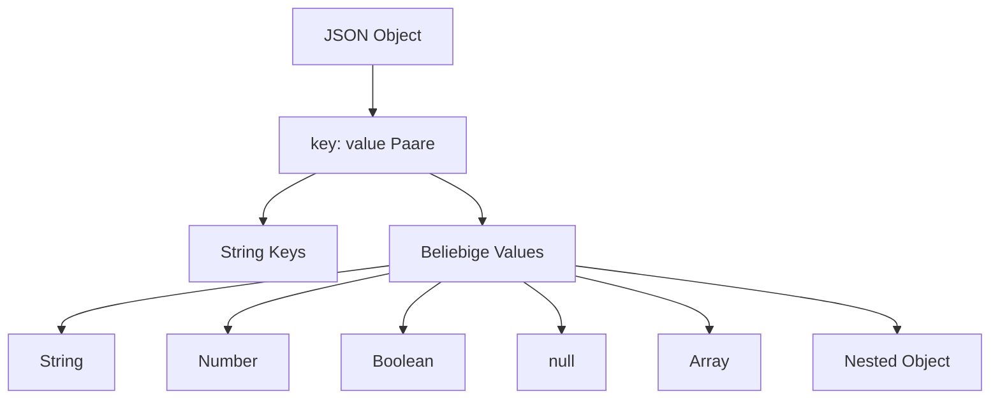

# JSON - JavaScript Object Notation

## Überblick

JSON ist ein **leichtgewichtiges Datenaustauschformat**, das einfach zu lesen und zu schreiben ist.

## Syntax-Regeln

```
┌─────────────────────────────────────────────────────────────────┐
│ JSON Datentypen                                                  │
├─────────────────────────────────────────────────────────────────┤
│ String     →  "Hello World"        (immer doppelte Anführungen) │
│ Number     →  42, 3.14, -17        (keine Anführungen)          │
│ Boolean    →  true, false          (kleingeschrieben)           │
│ null       →  null                 (kleingeschrieben)           │
│ Array      →  [1, 2, 3]            (eckige Klammern)            │
│ Object     →  {"key": "value"}     (geschweifte Klammern)       │
└─────────────────────────────────────────────────────────────────┘
```

## Struktur eines JSON-Objekts



## Beispiel: Playlist-Objekt

```json
{
    "name": "My Playlist",
    "user": "Ich",
    "duration": 10.30,
    "tracks": [
        {
            "title": "Track_1",
            "link": "https://somelink.com/track_1",
            "duration": 3.15,
            "access_credentials": {
                "uID": "my_ID",
                "token": "some_token"
            }
        },
        {
            "title": "Track_2",
            "link": "https://somelink.com/track_2",
            "duration": 7.15
        }
    ]
}
```

## Visualisierung der Struktur

```
Playlist
├── name: "My Playlist"
├── user: "Ich"
├── duration: 10.30
└── tracks: [Array]
    ├── [0]
    │   ├── title: "Track_1"
    │   ├── link: "https://..."
    │   ├── duration: 3.15
    │   └── access_credentials
    │       ├── uID: "my_ID"
    │       └── token: "some_token"
    └── [1]
        ├── title: "Track_2"
        ├── link: "https://..."
        └── duration: 7.15
```

## Mehrere Objekte mit ID-Zugriff

```json
{
    "basket001": {
        "checkout": true,
        "Customer": {
            "name": "Test Tester",
            "email": "test@test.com"
        },
        "products": [
            {"name": "product1", "amount": 10, "price": 50.0}
        ]
    },
    "basket002": {
        "checkout": false,
        "Customer": {
            "name": "Another Tester",
            "email": "another@test.com"
        },
        "products": [
            {"name": "product3", "amount": 20, "price": 5.5}
        ]
    }
}
```

## JSON vs XML

| Aspekt | JSON | XML |
|--------|------|-----|
| Syntax | Leichtgewichtig | Verbose (mehr Text) |
| Lesbarkeit | Einfach | Komplexer |
| Datentypen | Nativ (String, Number, Boolean) | Alles ist Text |
| Attributierung | Nicht möglich | Möglich |
| Overhead | Gering | Höher |
| Parsing | Schneller | Langsamer |

**Warum JSON statt XML für Web-Apps?**
> XML ist eine Metasprache zum Definieren komplexer Konstrukte. Für einfache Datenübertragung wie Playlists erhöht XML die Datenmenge und den Verarbeitungsaufwand ohne greifbaren Nutzen. JSON ermöglicht strukturierte Speicherung, Verarbeitung und Übertragung ohne Overhead.

## JavaScript und JSON

```javascript
// JSON String → JavaScript Object
const obj = JSON.parse('{"name": "Test"}');

// JavaScript Object → JSON String
const jsonString = JSON.stringify({name: "Test"});

// Zugriff auf Daten
const playlistName = playlist.name;
const firstTrack = playlist.tracks[0];
const trackTitle = playlist.tracks[0].title;
```

## Häufige Fehler

```
❌ FALSCH                          ✓ RICHTIG
─────────────────────────────────────────────────
{'key': 'value'}                  {"key": "value"}
                                  (doppelte Anführungen!)

{key: "value"}                    {"key": "value"}
                                  (Keys müssen Strings sein!)

{"number": 42,}                   {"number": 42}
                                  (kein trailing comma!)

{"active": True}                  {"active": true}
                                  (kleingeschrieben!)
```
