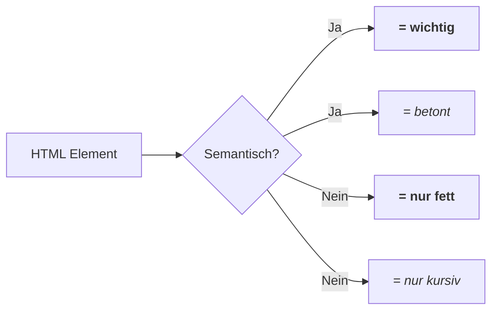

# HTML - Hypertext Markup Language

## Überblick

HTML dient der **Beschreibung und Strukturierung** von Web-Dokumenten. Es beschreibt Inhalte wie Text, Grafiken und Videos.

## Grundstruktur

```html
<!DOCTYPE html>
<html lang="de">
<head>
    <meta charset="UTF-8">
    <title>Seitentitel</title>
    <link rel="stylesheet" href="styles.css">
</head>
<body>
    <!-- Sichtbarer Inhalt -->
    <h1>Überschrift</h1>
    <p>Ein Absatz</p>
</body>
</html>
```

## Dokument-Hierarchie

```
<!DOCTYPE html>
└── <html>
    ├── <head>
    │   ├── <meta>
    │   ├── <title>
    │   └── <link>
    └── <body>
        ├── <header>
        ├── <main>
        │   ├── <section>
        │   └── <article>
        └── <footer>
```

## Wichtige HTML-Elemente

### Strukturelemente

```html
<div>       <!-- Generischer Container (Block) -->
<span>      <!-- Generischer Container (Inline) -->
<header>    <!-- Kopfbereich -->
<nav>       <!-- Navigation -->
<main>      <!-- Hauptinhalt -->
<section>   <!-- Thematische Gruppe -->
<article>   <!-- Eigenständiger Inhalt -->
<footer>    <!-- Fußbereich -->
```

### Textelemente

```html
<h1> - <h6>  <!-- Überschriften (h1 = größte) -->
<p>          <!-- Absatz -->
<a href="">  <!-- Link -->
<b>          <!-- Fett (nur Darstellung) -->
<strong>     <!-- Fett (semantisch: wichtig) -->
<i>          <!-- Kursiv (nur Darstellung) -->
<em>         <!-- Kursiv (semantisch: betont) -->
```

### Listen

```html
<!-- Ungeordnete Liste -->
<ul>
    <li>Element 1</li>
    <li>Element 2</li>
</ul>

<!-- Geordnete Liste -->
<ol>
    <li>Erster</li>
    <li>Zweiter</li>
</ol>
```

### Formular-Elemente

```html
<form>
    <input type="text" id="name" placeholder="Name">
    <input type="email" id="email">
    <input type="password" id="pw">
    <button type="submit">Absenden</button>
</form>
```

## Playlist-Beispiel aus der Vorlesung

```html
<body>
    <!-- Playlist Display -->
    <div class="playlist">
        <h2>Playlist Details</h2>
        <ul id="playlist"></ul>
        <div id="total-duration">Total Duration: 0:00</div>
        <button id="save-playlist">Save Playlist</button>
    </div>
</body>
```

### Als Baumstruktur

```
<body>
└── <div class="playlist">
    ├── <h2>
    │   └── "Playlist Details"
    ├── <ul id="playlist">
    │   └── (wird durch JS befüllt)
    ├── <div id="total-duration">
    │   └── "Total Duration: 0:00"
    └── <button id="save-playlist">
        └── "Save Playlist"
```

## Attribute

```html
<element attribut="wert">

<!-- Wichtige Attribute -->
<div id="eindeutig">         <!-- Eindeutige ID -->
<div class="mehrfach">       <!-- CSS-Klasse -->
<a href="https://...">       <!-- Link-Ziel -->
  <!-- Bildquelle -->
<input type="text">          <!-- Input-Typ -->
```

## ID vs Class

```
┌─────────────────────────────────────────────────────────────────┐
│ ID (id="name")                                                   │
│ • Eindeutig pro Dokument                                        │
│ • Für JavaScript: getElementById()                              │
│ • CSS: #name { }                                                │
├─────────────────────────────────────────────────────────────────┤
│ CLASS (class="name")                                            │
│ • Mehrfach verwendbar                                           │
│ • Für Gruppen von Elementen                                     │
│ • CSS: .name { }                                                │
└─────────────────────────────────────────────────────────────────┘
```

## Semantik vs Darstellung



> **Semantische Elemente** beschreiben die **Bedeutung** des Inhalts, nicht nur dessen Darstellung.
