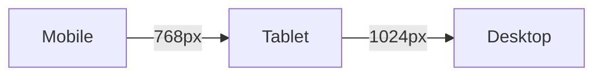

# CSS - Cascading Style Sheets

## Überblick

CSS definiert die **Darstellung** (Styling) und das **Layout** von HTML-Dokumenten:
- **Styling**: Farben, Fonts, Größen
- **Layout**: Positionen, Abstände

## CSS-Syntax

```css
selektor {
    eigenschaft: wert;
    eigenschaft: wert;
}
```

```
┌─────────────────────────────────────────────────────────────────┐
│ h2 {                                                             │
│   color: green;                                                 │
│   font-size: 24px;                                              │
│ }                                                               │
│ ↑   ↑       ↑                                                   │
│ │   │       └── Wert                                            │
│ │   └── Eigenschaft                                             │
│ └── Selektor (welche Elemente?)                                 │
└─────────────────────────────────────────────────────────────────┘
```

## Selektoren

### Element-Selektor
```css
h2 {
    color: green;
}
/* Alle <h2> Elemente */
```

### Klassen-Selektor
```css
.playlist {
    background: #f0f0f0;
}
/* Alle Elemente mit class="playlist" */
```

### ID-Selektor
```css
#total-duration {
    font-weight: bold;
}
/* Element mit id="total-duration" */
```

### Verschachtelte Selektoren
```css
li a {
    color: blue;
}
/* Alle <a> innerhalb von <li> */
```

```
Selektor-Hierarchie:

<ul>
  └── <li>
        └── <a>  ← li a trifft hier
```

## Klausur-Beispiel: Playlist Styling

**Aufgabe:** Header "Playlist Details" in grün, Track-Links in blau

```html
<div class="playlist">
    <h2>Playlist Details</h2>
    <ul id="playlist">
        <li><a href="...">Track 1</a></li>
        <li><a href="...">Track 2</a></li>
    </ul>
</div>
```

**Lösung:**
```css
h2 {
    color: green;
}

li a {
    color: blue;
}
```

## Wichtige CSS-Eigenschaften

### Farben
```css
color: green;              /* Textfarbe */
background-color: #f0f0f0; /* Hintergrund */
border-color: red;         /* Rahmenfarbe */
```

### Größen
```css
font-size: 16px;           /* Schriftgröße */
width: 100%;               /* Breite */
height: 200px;             /* Höhe */
padding: 10px;             /* Innenabstand */
margin: 20px;              /* Außenabstand */
```

### Text
```css
font-family: Arial, sans-serif;
font-weight: bold;
text-align: center;
text-decoration: none;     /* Kein Unterstrich */
```

## Box-Modell

```
┌──────────────────────────────────────────────┐
│                   MARGIN                      │
│  ┌────────────────────────────────────────┐  │
│  │              BORDER                     │  │
│  │  ┌──────────────────────────────────┐  │  │
│  │  │           PADDING                 │  │  │
│  │  │  ┌────────────────────────────┐  │  │  │
│  │  │  │                            │  │  │  │
│  │  │  │         CONTENT            │  │  │  │
│  │  │  │                            │  │  │  │
│  │  │  └────────────────────────────┘  │  │  │
│  │  └──────────────────────────────────┘  │  │
│  └────────────────────────────────────────┘  │
└──────────────────────────────────────────────┘
```

```css
.box {
    margin: 20px;      /* Außenabstand */
    border: 1px solid; /* Rahmen */
    padding: 10px;     /* Innenabstand */
    width: 200px;      /* Inhaltsbreite */
}
```

## CSS einbinden

### 1. Externes Stylesheet (empfohlen)
```html
<head>
    <link rel="stylesheet" href="styles.css">
</head>
```

### 2. Im Head-Bereich
```html
<head>
    <style>
        h2 { color: green; }
    </style>
</head>
```

### 3. Inline (vermeiden)
```html
<h2 style="color: green;">Text</h2>
```

## Spezifität (Cascading)

```
Priorität (höher = stärker):

1. !important          → Überschreibt alles
2. Inline style=""     → 1000 Punkte
3. #id                 → 100 Punkte
4. .class              → 10 Punkte
5. element             → 1 Punkt
```

```css
/* Beispiel: Was gewinnt? */
p { color: black; }           /* 1 Punkt */
.text { color: blue; }        /* 10 Punkte */
#intro { color: red; }        /* 100 Punkte - GEWINNT */
```

## Responsive Design

```css
/* Mobile First */
.container {
    width: 100%;
}

/* Ab 768px Bildschirmbreite */
@media (min-width: 768px) {
    .container {
        width: 750px;
    }
}
```


