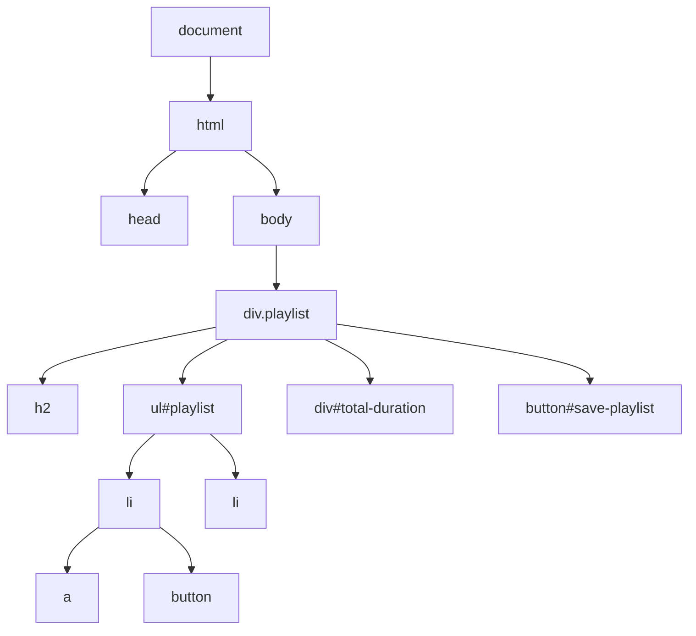

# JavaScript & DOM-Manipulation

## Überblick

JavaScript ermöglicht **dynamisches Verhalten** auf Webseiten durch Manipulation des DOM.

## Das DOM (Document Object Model)

Das DOM ist eine **Baumstruktur**, die das HTML-Dokument repräsentiert.



## Browser-Rendering-Prozess

```
┌──────────────────────────────────────────────────────────────────┐
│ 1. HTML empfangen                                                │
│    ↓                                                             │
│ 2. HTML parsen → DOM (Document Object Model) erstellen           │
│    ↓                                                             │
│ 3. CSS parsen → CSSOM (CSS Object Model) erstellen               │
│    ↓                                                             │
│ 4. DOM + CSSOM → Rendering Tree                                  │
│    ↓                                                             │
│ 5. Layout berechnen (Geometrien, Positionen)                     │
│    ↓                                                             │
│ 6. First Meaningful Paint (FMP) darstellen                       │
└──────────────────────────────────────────────────────────────────┘
```

## Elemente auswählen

### getElementById
```javascript
// Ein Element mit bestimmter ID
const playlist = document.getElementById('playlist');
const button = document.getElementById('save-playlist');
```

### querySelector / querySelectorAll
```javascript
// Erstes Element, das passt
const header = document.querySelector('h2');
const firstLink = document.querySelector('li a');

// Alle Elemente, die passen
const allLinks = document.querySelectorAll('li a');
```

## Elemente erstellen und ändern

### createElement & appendChild
```javascript
// Neues Element erstellen
const li = document.createElement('li');

// Inhalt setzen
li.innerHTML = `
    <a href="${track.link}">${track.title}</a>
    <button onclick="removeTrack(${index})">Remove</button>
`;

// An bestehendes Element anhängen
playlistContainer.appendChild(li);
```

### Visualisierung

```
VORHER:                          NACHHER:
<ul id="playlist">               <ul id="playlist">
</ul>                              <li>
                                     <a href="...">Track 1</a>
        appendChild(li)              <button>Remove</button>
        ─────────────────>         </li>
                                 </ul>
```

## Event Listener

```javascript
// Event Listener hinzufügen
const button = document.getElementById('save-playlist');

button.addEventListener('click', function() {
    // Code der beim Klick ausgeführt wird
    savePlaylist();
});

// Kurzform mit Arrow Function
button.addEventListener('click', () => savePlaylist());
```

### Wichtige Events

| Event | Beschreibung |
|-------|--------------|
| `click` | Mausklick |
| `submit` | Formular absenden |
| `change` | Wert geändert |
| `keyup` | Taste losgelassen |
| `load` | Seite geladen |

## Klausur-Beispiel: Playlist befüllen

**HTML:**
```html
<ul id="playlist"></ul>
```

**JavaScript:**
```javascript
const playlistContainer = document.getElementById('playlist');

playlists[currentPlaylist].forEach((track, index) => {
    const li = document.createElement('li');
    li.innerHTML = `
        <a href="${track.link}" target="_blank">
            ${track.title} (${track.duration})
        </a>
        <button onclick="removeTrack(${index})">Remove</button>
    `;
    playlistContainer.appendChild(li);
});
```

**Was passiert hier?**

```
┌─────────────────────────────────────────────────────────────────┐
│ 1. getElementById('playlist')                                    │
│    → Holt das <ul> Element mit ID "playlist"                    │
│                                                                  │
│ 2. forEach((track, index) => {...})                             │
│    → Iteriert über alle Tracks der Playlist                     │
│                                                                  │
│ 3. createElement('li')                                          │
│    → Erstellt ein neues <li> Element                            │
│                                                                  │
│ 4. li.innerHTML = `...`                                         │
│    → Setzt den HTML-Inhalt des <li> mit Link und Button         │
│                                                                  │
│ 5. appendChild(li)                                              │
│    → Hängt das neue <li> an die <ul> Liste an                   │
└─────────────────────────────────────────────────────────────────┘
```

## DOM nach JavaScript-Ausführung

```
<ul id="playlist">
├── <li>
│   ├── <a href="link1" target="_blank">
│   │   └── "Track 1 (3:15)"
│   └── <button onclick="removeTrack(0)">
│       └── "Remove"
├── <li>
│   ├── <a href="link2" target="_blank">
│   │   └── "Track 2 (4:20)"
│   └── <button onclick="removeTrack(1)">
│       └── "Remove"
└── ...
```

## Weitere DOM-Methoden

```javascript
// Text-Inhalt ändern
element.textContent = 'Neuer Text';

// Attribut setzen/lesen
element.setAttribute('href', 'https://...');
const href = element.getAttribute('href');

// CSS-Klassen
element.classList.add('active');
element.classList.remove('active');
element.classList.toggle('active');

// Element entfernen
element.remove();

// Parent-Element
const parent = element.parentElement;
```

## Typische Klausur-Aufgaben

1. **Erklären**, was ein JavaScript-Code-Ausschnitt macht
2. **1-2 Zeilen ergänzen**, z.B. einen Event-Listener hinzufügen
3. **DOM als Baum zeichnen** nach Ausführung von JavaScript
