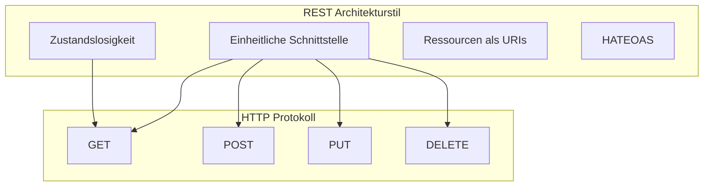

# REST - Representational State Transfer

## Überblick

REST ist ein **Architekturstil für verteilte Anwendungen**, der eine Reihe von Eigenschaften definiert.

## REST und HTTP



**Zusammenhang:**
> REST ist ein Architekturstil. HTTP ist ein zustandsloses Protokoll für Web-Kommunikation. REST kann auf HTTP aufsetzen und dessen Methoden (GET, POST, PUT, DELETE) für Zugriffe auf Ressourcen nutzen.

## REST-Prinzipien

```
┌─────────────────────────────────────────────────────────────────┐
│ 1. ZUSTANDSLOSIGKEIT (Stateless)                                │
│    Jede Anfrage enthält alle nötigen Informationen              │
│    Server speichert keinen Client-Zustand                       │
├─────────────────────────────────────────────────────────────────┤
│ 2. EINHEITLICHE SCHNITTSTELLE (Uniform Interface)               │
│    Ressourcen über URIs identifiziert                           │
│    Standard HTTP-Methoden                                       │
├─────────────────────────────────────────────────────────────────┤
│ 3. RESSOURCEN-ORIENTIERT                                        │
│    Alles ist eine Ressource (Playlist, Track, User)             │
│    URIs als eindeutige Identifikatoren                          │
├─────────────────────────────────────────────────────────────────┤
│ 4. HATEOAS                                                      │
│    Hypermedia as the Engine of Application State                │
│    Links in Responses für Navigation                            │
└─────────────────────────────────────────────────────────────────┘
```

## REST API Design

### Ressourcen und Endpunkte

```
Ressource: Playlists

/playlists              → Alle Playlists (Collection)
/playlists/123          → Eine bestimmte Playlist
/playlists/123/tracks   → Tracks einer Playlist
```

### HTTP-Methoden auf Ressourcen

| Methode | Endpoint | Beschreibung |
|---------|----------|--------------|
| GET | `/playlists` | Alle Playlists abrufen |
| GET | `/playlists/123` | Eine Playlist abrufen |
| POST | `/playlists` | Neue Playlist erstellen |
| PUT | `/playlists/123` | Playlist aktualisieren |
| DELETE | `/playlists/123` | Playlist löschen |

## Klausur-Beispiel: Playlist API

### Endpunkt definieren

```
/playlists – liefert die Namen aller Playlists
```

### Erweiterung mit Query Parameter

**Aufgabe:** Mindestgesamtlaufzeit in Minuten filtern

```
/playlists?duration=300
           ↑
           Query Parameter
```

### Vollständiger HTTP Request

```http
GET /playlists?duration=300 HTTP/1.1
Host: playlist-server.com:8001
User-Agent: Mein Browser
Accept: application/json

```

## REST API Beispiel: CRUD Operationen

```
┌─────────────────────────────────────────────────────────────────┐
│ CREATE (Erstellen)                                               │
│ POST /playlists                                                  │
│ Body: {"name": "Rock Classics", "tracks": [...]}                │
│ Response: 201 Created                                           │
├─────────────────────────────────────────────────────────────────┤
│ READ (Lesen)                                                     │
│ GET /playlists                                                   │
│ GET /playlists/123                                               │
│ Response: 200 OK + JSON Data                                    │
├─────────────────────────────────────────────────────────────────┤
│ UPDATE (Aktualisieren)                                          │
│ PUT /playlists/123                                               │
│ Body: {"name": "Updated Name", "tracks": [...]}                 │
│ Response: 200 OK                                                │
├─────────────────────────────────────────────────────────────────┤
│ DELETE (Löschen)                                                 │
│ DELETE /playlists/123                                            │
│ Response: 204 No Content                                        │
└─────────────────────────────────────────────────────────────────┘
```

## OpenAPI Spezifikation

REST APIs werden oft mit **OpenAPI** (früher Swagger) dokumentiert:

```yaml
openapi: 3.0.0
info:
  title: Playlist API
  version: 1.0.0
paths:
  /playlists:
    get:
      summary: Alle Playlists abrufen
      parameters:
        - name: duration
          in: query
          schema:
            type: integer
      responses:
        '200':
          description: Liste von Playlists
```

## Architektur-Diagramm

```
┌─────────────┐         HTTP/REST          ┌─────────────┐
│             │ =========================> │             │
│   Client    │   GET /playlists           │   Server    │
│  (Browser)  │                            │  (Flask)    │
│             │ <========================= │             │
│             │   200 OK + JSON            │             │
└─────────────┘                            └─────────────┘
                                                  │
                                                  │ REST API
                                                  ↓
                                           ┌─────────────┐
                                           │  Datenbank  │
                                           │  (CouchDB)  │
                                           └─────────────┘
```

## Testen von REST APIs

1. **curl**
   ```bash
   curl -X GET "http://localhost:8001/playlists?duration=300"
   curl -X POST -H "Content-Type: application/json" \
        -d '{"name":"Test"}' http://localhost:8001/playlists
   ```

2. **Postman** - GUI-Tool für API-Testing

3. **Swagger UI** - Interaktive API-Dokumentation

4. **Browser** - Nur für GET-Requests
