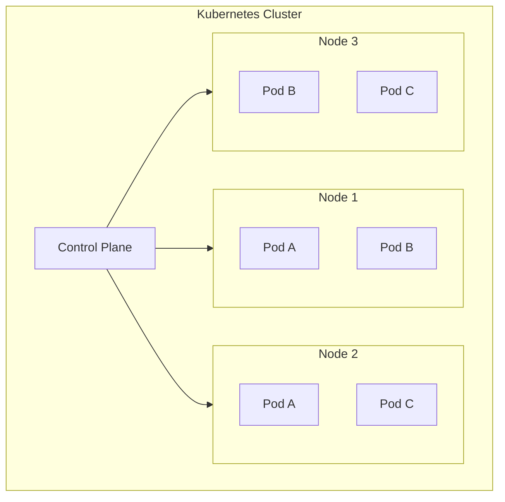

# Kubernetes - Begriffe und Konzepte

## Was ist Kubernetes?

Kubernetes (K8s) **orchestriert Container**. Es baut komplexe, verteilte Systeme aus containerisierten Anwendungen auf und verwaltet diese.



## Grundbegriffe

### Node

```
┌─────────────────────────────────────────────────────────────────┐
│ NODE                                                             │
│ • Physischer oder virtueller Rechner im Cluster                 │
│ • Über Internet Stack (IP) vernetzt                             │
│ • Führt Pods aus                                                │
│ • Hat eine Node IP (erreichbar von außen)                       │
└─────────────────────────────────────────────────────────────────┘

+------------------+     +------------------+     +------------------+
|     Node 1       |     |     Node 2       |     |     Node 3       |
|  192.168.1.10    |     |  192.168.1.11    |     |  192.168.1.12    |
|                  |     |                  |     |                  |
|  [Pod] [Pod]     |     |  [Pod] [Pod]     |     |  [Pod] [Pod]     |
+------------------+     +------------------+     +------------------+
```

### Pod

```
┌─────────────────────────────────────────────────────────────────┐
│ POD                                                              │
│ • Kleinste deploybare Einheit in K8s                            │
│ • Enthält einen oder mehrere Container                          │
│ • Container in einem Pod teilen sich Netzwerk und Storage       │
│ • Hat eine Cluster IP (nur intern erreichbar)                   │
└─────────────────────────────────────────────────────────────────┘

┌──────────────────────────────┐
│           POD                │
│  ┌──────────┐ ┌──────────┐  │
│  │Container1│ │Container2│  │
│  │  nginx   │ │  sidecar │  │
│  └──────────┘ └──────────┘  │
│                              │
│  Shared Network: 10.0.0.5    │
│  Shared Volume: /data        │
└──────────────────────────────┘
```

### Container

```
┌─────────────────────────────────────────────────────────────────┐
│ CONTAINER                                                        │
│ • Isolierte Anwendung mit eigenen Ressourcen                    │
│ • Läuft innerhalb eines Pods                                    │
│ • Basiert auf einem Image (z.B. nginx:latest)                   │
│ • Hat eigenen Namensraum aber teilt Netzwerk mit Pod           │
└─────────────────────────────────────────────────────────────────┘
```

### Service

```
┌─────────────────────────────────────────────────────────────────┐
│ SERVICE                                                          │
│ • Abstraktion für Zugriff auf Pods                              │
│ • Stabile Adresse trotz dynamischer Pod-Verwaltung              │
│ • Load Balancing über mehrere Pods                              │
│ • Verschiedene Typen: ClusterIP, NodePort, LoadBalancer         │
└─────────────────────────────────────────────────────────────────┘

                    Service
                  (Port 22000)
                       │
           ┌──────────┼──────────┐
           │          │          │
           ↓          ↓          ↓
        ┌─────┐   ┌─────┐   ┌─────┐
        │Pod 1│   │Pod 2│   │Pod 3│
        └─────┘   └─────┘   └─────┘
```

### Deployment

```
┌─────────────────────────────────────────────────────────────────┐
│ DEPLOYMENT                                                       │
│ • Beschreibt gewünschten Zustand der Anwendung                  │
│ • Definiert Anzahl der Replicas                                 │
│ • K8s sorgt automatisch für den gewünschten Zustand             │
│ • Ermöglicht Rolling Updates                                    │
└─────────────────────────────────────────────────────────────────┘

Deployment: replicas=3
            │
            ├── Pod 1 (nginx)
            ├── Pod 2 (nginx)
            └── Pod 3 (nginx)
```

### Volume / Persistent Volume Claim (PVC)

```
┌─────────────────────────────────────────────────────────────────┐
│ VOLUME                                                           │
│ • Speicher, der Container-Neustarts überlebt                    │
│ • Kann von mehreren Containern im Pod geteilt werden            │
│                                                                  │
│ PERSISTENT VOLUME CLAIM (PVC)                                    │
│ • Anforderung für persistenten Speicher                         │
│ • Wird an ein Persistent Volume (PV) gebunden                   │
│ • Unabhängig vom Pod-Lebenszyklus                               │
└─────────────────────────────────────────────────────────────────┘

┌─────────────┐     ┌─────────────┐     ┌─────────────┐
│     Pod     │     │     PVC     │     │     PV      │
│             │ --> │  (Anfrage)  │ --> │  (Speicher) │
│ /data mount │     │  10GB, RWO  │     │  NFS/Cloud  │
└─────────────┘     └─────────────┘     └─────────────┘
```

## IP-Adressen im Cluster

```
┌─────────────────────────────────────────────────────────────────┐
│                        CLUSTER                                   │
│                                                                  │
│  ┌─────────────────────────────────────────────────────────┐    │
│  │ Node IP: 192.168.1.10 (von außen erreichbar)            │    │
│  │                                                          │    │
│  │   ┌─────────────────────────────────────────────────┐   │    │
│  │   │ Cluster IP: 10.0.0.5 (nur intern erreichbar)    │   │    │
│  │   │                                                  │   │    │
│  │   │   ┌──────────┐   ┌──────────┐                   │   │    │
│  │   │   │   Pod    │   │   Pod    │                   │   │    │
│  │   │   └──────────┘   └──────────┘                   │   │    │
│  │   │                                                  │   │    │
│  │   └─────────────────────────────────────────────────┘   │    │
│  └─────────────────────────────────────────────────────────┘    │
└─────────────────────────────────────────────────────────────────┘
```

| IP-Typ | Beschreibung | Erreichbarkeit |
|--------|--------------|----------------|
| **Node IP** | IP-Adresse des Knotens | Von außen |
| **Cluster IP** | Virtuelle IP für Services | Nur intern |
| **Pod IP** | IP eines einzelnen Pods | Nur intern |

## Warum Services statt direkter Pod-Zugriff?

```
┌─────────────────────────────────────────────────────────────────┐
│ PROBLEM ohne Service:                                            │
│ • Pods werden dynamisch verwaltet (skaliert, neu gestartet)     │
│ • Pod-Adressen können sich ändern                               │
│ • Cluster IPs sind nur intern erreichbar                        │
│                                                                  │
│ LÖSUNG mit Service:                                              │
│ • Stabile Adresse nach außen                                    │
│ • K8s leitet automatisch an passende Pods weiter                │
│ • Wir müssen uns nicht um Pod-Verfügbarkeit kümmern            │
└─────────────────────────────────────────────────────────────────┘
```

## K8s als "Betriebssystem der Cloud"

```
┌────────────────────────┬────────────────────────┐
│    Betriebssystem      │      Kubernetes        │
├────────────────────────┼────────────────────────┤
│ Abstrahiert lokale     │ Abstrahiert Netzwerk   │
│ Hardware-Ressourcen    │ und Rechnerknoten      │
├────────────────────────┼────────────────────────┤
│ Kernel als zentrale    │ Control Plane als      │
│ Management-Instanz     │ Management-Instanz     │
├────────────────────────┼────────────────────────┤
│ Scheduler verteilt     │ kube-scheduler         │
│ Prozesse auf Kerne     │ verteilt Pods auf Nodes│
├────────────────────────┼────────────────────────┤
│ Prozesse isolieren     │ Container isolieren    │
│ Anwendungen            │ Anwendungen            │
├────────────────────────┼────────────────────────┤
│ System Calls für       │ API Server für         │
│ Ressourcenzugriff      │ Ressourcenzugriff      │
└────────────────────────┴────────────────────────┘
```
