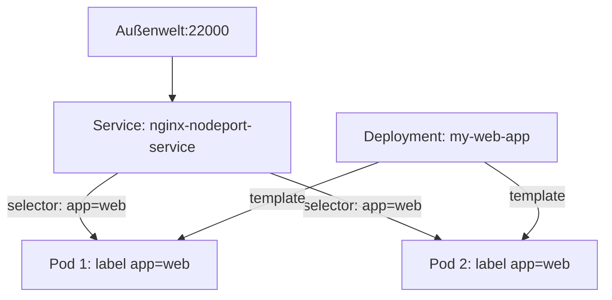

# Kubernetes Manifests

## Was ist ein Manifest?

Ein Manifest ist eine **YAML-Datei**, die den gewünschten Zustand von Kubernetes-Ressourcen beschreibt.

> **Klausur-Hinweis:** Sie müssen Manifests **lesen** und als **Diagramm darstellen** können. Sie müssen sie **nicht schreiben**.

## Manifest-Grundstruktur

```yaml
apiVersion: apps/v1          # API-Version
kind: Deployment             # Ressourcen-Typ
metadata:                    # Metadaten
  name: my-web-app
  labels:
    app: web-deploy
spec:                        # Spezifikation
  # ... Details der Ressource
```

## Klausur-Beispiel: Deployment + Service

### Das Manifest

```yaml
# DEPLOYMENT
apiVersion: apps/v1
kind: Deployment
metadata:
  name: my-web-app
  labels:
    app: web-deploy
spec:
  replicas: 2                    # 2 Pods erstellen
  selector:
    matchLabels:
      app: web                   # Pods mit diesem Label verwalten
  template:
    metadata:
      labels:
        app: web                 # Label für die Pods
    spec:
      containers:
      - name: web-container
        image: nginx:latest      # Container-Image
        ports:
        - containerPort: 80      # Container lauscht auf Port 80

---
# SERVICE
kind: Service
metadata:
  name: nginx-nodeport-service
  labels:
    app: web
spec:
  selector:
    app: web                     # Verbindet sich mit Pods mit Label app=web
  ports:
  - protocol: TCP
    port: 80                     # Service-Port (intern)
    targetPort: 80               # Container-Port
    nodePort: 22000              # Port nach außen
  type: NodePort                 # Service-Typ
```

### Das resultierende System

```
                           Außenwelt
                               │
                               │ Port 22000
                               ↓
┌──────────────────────────────────────────────────────────────────┐
│                        KUBERNETES CLUSTER                         │
│                                                                   │
│    ┌─────────────────────────────────────────────────────────┐   │
│    │            Service: nginx-nodeport-service               │   │
│    │                    (NodePort: 22000)                     │   │
│    │                     (Port: 80)                           │   │
│    └───────────────────────────┬─────────────────────────────┘   │
│                                │                                  │
│              ┌─────────────────┼─────────────────┐               │
│              │                 │                 │               │
│              ↓                 ↓                 ↓               │
│    ┌─────────────────────────────────────────────────────────┐   │
│    │              Deployment: my-web-app                      │   │
│    │                   (replicas: 2)                          │   │
│    │                                                          │   │
│    │  ┌──────────────────┐      ┌──────────────────┐         │   │
│    │  │      Pod 1       │      │      Pod 2       │         │   │
│    │  │  label: app=web  │      │  label: app=web  │         │   │
│    │  │                  │      │                  │         │   │
│    │  │ ┌──────────────┐ │      │ ┌──────────────┐ │         │   │
│    │  │ │ Container    │ │      │ │ Container    │ │         │   │
│    │  │ │ nginx:latest │ │      │ │ nginx:latest │ │         │   │
│    │  │ │ Port: 80     │ │      │ │ Port: 80     │ │         │   │
│    │  │ └──────────────┘ │      │ └──────────────┘ │         │   │
│    │  └──────────────────┘      └──────────────────┘         │   │
│    └─────────────────────────────────────────────────────────┘   │
│                                                                   │
│  Node 1                      Node 2                               │
│  (192.168.1.10)              (192.168.1.11)                       │
└──────────────────────────────────────────────────────────────────┘
```

## Manifest lesen: Schritt für Schritt

### 1. Deployment analysieren

```yaml
kind: Deployment              # Was? → Ein Deployment
metadata:
  name: my-web-app           # Name des Deployments
spec:
  replicas: 2                # Wie viele Pods? → 2
  selector:
    matchLabels:
      app: web               # Welche Pods verwalten? → mit label app=web
  template:
    spec:
      containers:
      - name: web-container
        image: nginx:latest  # Welches Image? → nginx
        ports:
        - containerPort: 80  # Welcher Port? → 80
```

### 2. Service analysieren

```yaml
kind: Service                # Was? → Ein Service
metadata:
  name: nginx-nodeport-service
spec:
  type: NodePort             # Typ? → NodePort (von außen erreichbar)
  selector:
    app: web                 # Mit welchen Pods verbunden? → app=web
  ports:
  - port: 80                 # Interner Service-Port
    targetPort: 80           # Port im Container
    nodePort: 22000          # Externer Port
```

### 3. Verbindung verstehen



## Service-Typen

```
┌─────────────────────────────────────────────────────────────────┐
│ ClusterIP (Default)                                              │
│ • Nur innerhalb des Clusters erreichbar                         │
│ • Virtuelle IP-Adresse                                          │
├─────────────────────────────────────────────────────────────────┤
│ NodePort                                                         │
│ • Von außen über Node-IP:NodePort erreichbar                    │
│ • Port-Range: 30000-32767                                       │
├─────────────────────────────────────────────────────────────────┤
│ LoadBalancer                                                     │
│ • Externer Load Balancer (Cloud-Provider)                       │
│ • Eigene externe IP                                             │
└─────────────────────────────────────────────────────────────────┘
```

## Port-Mapping verstehen

```
Außenwelt                    Service                    Container
    │                           │                           │
    │  NodePort: 22000          │  port: 80                 │  containerPort: 80
    │ ────────────────────────> │ ───────────────────────>  │
    │                           │  targetPort: 80           │
    │                           │                           │

Zugriff: http://192.168.1.10:22000
         (Node-IP)    (NodePort)
```

## Labels und Selektoren

```
Labels = Schlüssel-Wert-Paare zur Identifikation

┌─────────────────┐         ┌─────────────────┐
│ Deployment      │         │ Service         │
│                 │         │                 │
│ template:       │         │ selector:       │
│   labels:       │ ←─────→ │   app: web      │
│     app: web    │ MATCH!  │                 │
└─────────────────┘         └─────────────────┘

Der Service findet alle Pods mit dem Label "app: web"
```

## Manifest als Diagramm zeichnen (Klausur-Aufgabe)

**Schritte:**
1. Identifiziere alle Ressourcen (Deployment, Service, etc.)
2. Lese `replicas` → Anzahl der Pods
3. Lese `containers` → Was läuft in den Pods?
4. Lese Service `type` und `ports` → Wie erreichbar?
5. Verbinde über `selector` und `labels`
6. Zeichne das Diagramm mit Cluster, Nodes, Pods, Service
