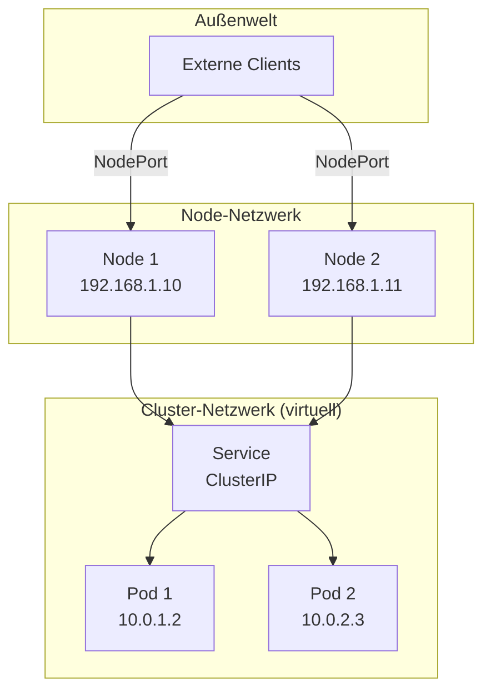

# Kubernetes Netzwerkmodell

## Überblick

Das Kubernetes-Netzwerkmodell legt ein **virtuelles Netzwerk** über alle Nodes des Clusters.

```
┌──────────────────────────────────────────────────────────────────┐
│                    KUBERNETES CLUSTER                             │
│                                                                   │
│                  Virtuelles Cluster-Netzwerk                      │
│           ┌─────────────────────────────────────────┐            │
│           │          10.0.0.0/16                     │            │
│           │                                          │            │
│  ┌────────┼────────┐    ┌──────────┼──────────┐     │            │
│  │  Node 1│        │    │  Node 2  │          │     │            │
│  │  ┌─────┴─────┐  │    │  ┌───────┴───────┐  │     │            │
│  │  │Pod 10.0.1.2│ │    │  │Pod 10.0.2.3   │  │     │            │
│  │  │Pod 10.0.1.3│ │    │  │Pod 10.0.2.4   │  │     │            │
│  │  └───────────┘  │    │  └───────────────┘  │     │            │
│  │                 │    │                     │     │            │
│  │  192.168.1.10   │    │  192.168.1.11       │     │            │
│  └─────────────────┘    └─────────────────────┘     │            │
│           └─────────────────────────────────────────┘            │
└──────────────────────────────────────────────────────────────────┘
```

## Netzwerk-Ebenen



## Die drei Netzwerk-Ebenen

### 1. Externes Netzwerk

```
┌─────────────────────────────────────────────────────────────────┐
│ EXTERNES NETZWERK                                                │
│ • Internet / Firmennetzwerk                                     │
│ • Erreichbar über Node IPs + NodePort                           │
│ • Oder über LoadBalancer-IP                                     │
└─────────────────────────────────────────────────────────────────┘

Beispiel: http://192.168.1.10:22000
```

### 2. Node-Netzwerk

```
┌─────────────────────────────────────────────────────────────────┐
│ NODE-NETZWERK                                                    │
│ • Physische/Virtuelle Rechner im Cluster                        │
│ • Haben "echte" IP-Adressen (Node IPs)                          │
│ • Von außen erreichbar                                          │
│ • Kommunizieren über Standard TCP/IP                            │
└─────────────────────────────────────────────────────────────────┘

Node 1: 192.168.1.10
Node 2: 192.168.1.11
Node 3: 192.168.1.12
```

### 3. Cluster-Netzwerk (Pod-Netzwerk)

```
┌─────────────────────────────────────────────────────────────────┐
│ CLUSTER-NETZWERK (Virtuell)                                      │
│ • Virtuelles Overlay-Netzwerk                                   │
│ • Pods bekommen Cluster IPs                                     │
│ • NUR innerhalb des Clusters erreichbar                         │
│ • Pods können sich gegenseitig direkt erreichen                 │
│ • Unabhängig davon, auf welchem Node sie laufen                │
└─────────────────────────────────────────────────────────────────┘

Pod 1: 10.0.1.2 (auf Node 1)
Pod 2: 10.0.2.3 (auf Node 2)
→ Pod 1 kann Pod 2 direkt über 10.0.2.3 erreichen
```

## Pod-zu-Pod Kommunikation

```
┌────────────────────────────────────────────────────────────────────┐
│                                                                    │
│  Node 1                              Node 2                        │
│  ┌──────────────────┐                ┌──────────────────┐         │
│  │ Pod A            │                │ Pod B            │         │
│  │ 10.0.1.2         │ ─────────────> │ 10.0.2.3         │         │
│  │                  │   Direkte      │                  │         │
│  │                  │   Verbindung   │                  │         │
│  └──────────────────┘   über Cluster │──────────────────┘         │
│                         Netzwerk                                   │
│                                                                    │
└────────────────────────────────────────────────────────────────────┘

• Jeder Pod hat eine eigene IP im Cluster-Netzwerk
• Pods können sich gegenseitig direkt erreichen
• Keine NAT zwischen Pods nötig
```

## Service als Abstraktion

```
PROBLEM:
• Pod-IPs ändern sich (Neustart, Skalierung)
• Von außen sind Cluster-IPs nicht erreichbar

LÖSUNG: Service

                    ┌─────────────────┐
    Anfrage ──────> │     Service     │
    (stabile IP)    │   10.96.0.1:80  │
                    └────────┬────────┘
                             │
                    Load Balancing
                             │
              ┌──────────────┼──────────────┐
              ↓              ↓              ↓
         ┌────────┐    ┌────────┐    ┌────────┐
         │ Pod 1  │    │ Pod 2  │    │ Pod 3  │
         │10.0.1.2│    │10.0.1.3│    │10.0.2.4│
         └────────┘    └────────┘    └────────┘
              ↑              ↑              ↑
              │              │              │
         Diese Pods können sich ändern,
         der Service bleibt stabil
```

## Von außen in den Cluster

### NodePort Service

```
Internet
    │
    │ http://192.168.1.10:22000
    ↓
┌───────────────────────────────────────────────────────────────┐
│ NODE 1 (192.168.1.10)                                         │
│                                                               │
│    Port 22000 ────> Service ────> Pod (Port 80)               │
│                                                               │
└───────────────────────────────────────────────────────────────┘

Zugriff über: <NODE-IP>:<NODE-PORT>
Beispiel:     192.168.1.10:22000
```

### Port-Flow

```
┌────────────────────────────────────────────────────────────────┐
│                                                                │
│  Extern          Node           Service         Pod/Container  │
│    │               │               │                │          │
│    │──── 22000 ───>│               │                │          │
│    │               │──── 80 ──────>│                │          │
│    │               │               │───── 80 ──────>│          │
│    │               │               │                │          │
│                                                                │
│  NodePort       kube-proxy      ClusterIP      targetPort      │
│                                                                │
└────────────────────────────────────────────────────────────────┘
```

## Zusammenfassung: Was erreiche ich womit?

```
┌─────────────────┬────────────────────┬─────────────────────────┐
│ Was ich habe    │ Was ich erreiche   │ Erreichbar von          │
├─────────────────┼────────────────────┼─────────────────────────┤
│ Pod IP          │ Einen Pod          │ Nur Cluster-intern      │
│ (10.0.1.2)      │                    │                         │
├─────────────────┼────────────────────┼─────────────────────────┤
│ ClusterIP       │ Service (LB zu     │ Nur Cluster-intern      │
│ (10.96.0.1)     │ mehreren Pods)     │                         │
├─────────────────┼────────────────────┼─────────────────────────┤
│ Node IP +       │ Service über       │ Von außen               │
│ NodePort        │ beliebigen Node    │                         │
│ (192.168.1.10   │                    │                         │
│  :22000)        │                    │                         │
├─────────────────┼────────────────────┼─────────────────────────┤
│ LoadBalancer IP │ Service über       │ Von außen               │
│ (externe IP)    │ Cloud LB           │ (Cloud-Umgebung)        │
└─────────────────┴────────────────────┴─────────────────────────┘
```

## Klausur-relevante Fragen

1. **Warum sind Pod-IPs nur intern erreichbar?**
   → Virtuelle Cluster-IPs, nur im Overlay-Netzwerk bekannt

2. **Warum brauchen wir Services?**
   → Pods sind dynamisch, Services bieten stabile Adressen

3. **Wie erreiche ich einen Service von außen?**
   → NodePort: Node-IP + NodePort
   → LoadBalancer: Externe IP

4. **Was bedeutet das virtuelle Netzwerk?**
   → Kubernetes legt ein Overlay-Netzwerk über alle Nodes
   → Pods können sich unabhängig vom physischen Node erreichen
