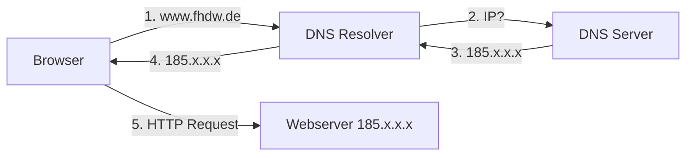
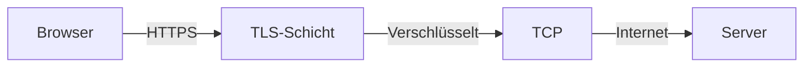

# DNS & TLS (Oberflächlich)

> **Klausur-Hinweis:** Nur oberflächliches Wissen nötig. Wissen, was es ist und wozu es eingesetzt wird. Keine Details wie DNS-Bäume oder TLS-Handshake-Schritte.

## DNS - Domain Name System

### Was ist DNS?

```
┌─────────────────────────────────────────────────────────────────┐
│ DNS = Domain Name System                                         │
│                                                                  │
│ Übersetzt menschenlesbare Domainnamen in IP-Adressen            │
│                                                                  │
│ www.example.com  ──────>  93.184.216.34                         │
│ (Domain)         DNS      (IP-Adresse)                          │
└─────────────────────────────────────────────────────────────────┘
```

### Wozu wird DNS eingesetzt?



| Einsatzzweck | Beschreibung |
|--------------|--------------|
| **Namensauflösung** | Domain → IP-Adresse |
| **Load Balancing** | Mehrere IPs für eine Domain |
| **Redundanz** | Mehrere Server hinter einer Domain |
| **CDN** | Geographisch nächsten Server finden |
| **Service Discovery** | Verschiedene Dienste einer Domain |

### Einfaches Beispiel

```
Benutzer tippt:     www.fhdw.de
                         │
                         ↓
DNS Auflösung:      185.xxx.xxx.xxx
                         │
                         ↓
Browser verbindet:  HTTP Request an 185.xxx.xxx.xxx
```

### Lokale Namensauflösung (/etc/hosts)

```
# Datei: /etc/hosts
10.0.0.10   wta.meinedomain.stehr

# Jetzt funktioniert:
curl wta.meinedomain.stehr:8001
```

→ Hilfreich für lokale Entwicklung und Service Discovery

### Sicherheitsprobleme (nur oberflächlich)

| Problem | Beschreibung |
|---------|--------------|
| **DNS Spoofing** | Falsche IP-Adressen zurückgeben → Malware-Seiten |
| **Verfolgung** | DNS-Betreiber sehen, welche Domains man aufruft |

**Gegenmaßnahmen:**
- DNSSEC (Authentizität)
- DNS over HTTPS/TLS (Vertraulichkeit)

---

## TLS - Transport Layer Security

### Was ist TLS?

```
┌─────────────────────────────────────────────────────────────────┐
│ TLS = Transport Layer Security                                   │
│                                                                  │
│ Sichert die Kommunikation auf der Transportschicht              │
│ • Verschlüsselung (Vertraulichkeit)                             │
│ • Authentifizierung (Identitätsprüfung)                         │
│ • Integrität (Daten unverändert)                                │
└─────────────────────────────────────────────────────────────────┘
```

### Wozu wird TLS eingesetzt?

```
HTTP  (unverschlüsselt)     Port 80
   │
   + TLS
   │
   ↓
HTTPS (verschlüsselt)       Port 443
```

| Einsatzzweck | Beschreibung |
|--------------|--------------|
| **HTTPS** | Sichere Webseiten-Kommunikation |
| **Verschlüsselung** | Daten können nicht mitgelesen werden |
| **Authentifizierung** | Server-Identität wird geprüft (Zertifikat) |
| **Integrität** | Daten werden nicht manipuliert |

### TLS im Einsatz



```
┌──────────────────────────────────────────────────────────────────┐
│                                                                  │
│  Browser                                    Webserver            │
│     │                                           │                │
│     │ ──────── TLS Handshake ─────────────────> │                │
│     │ <─────── Zertifikat ──────────────────── │                │
│     │                                           │                │
│     │ ════════ Verschlüsselte Daten ══════════ │                │
│     │                                           │                │
└──────────────────────────────────────────────────────────────────┘
```

### HTTP vs HTTPS

```
HTTP (ohne TLS):
┌─────────┐    Klartext    ┌─────────┐
│ Browser │ ─────────────> │ Server  │
└─────────┘    lesbar      └─────────┘
                  ↑
              Angreifer kann mitlesen

HTTPS (mit TLS):
┌─────────┐   Verschlüsselt   ┌─────────┐
│ Browser │ ═══════════════>  │ Server  │
└─────────┘   nicht lesbar    └─────────┘
                  ↑
              Angreifer sieht nur "Kauderwelsch"
```

### Wichtige Begriffe (nur Überblick)

| Begriff | Bedeutung |
|---------|-----------|
| **Zertifikat** | Digitaler Ausweis des Servers |
| **CA** | Certificate Authority - stellt Zertifikate aus |
| **Handshake** | Aushandlung der Verschlüsselung |
| **Port 443** | Standard-Port für HTTPS |

### Was TLS NICHT schützt

```
┌─────────────────────────────────────────────────────────────────┐
│ TLS verschlüsselt den INHALT, aber NICHT:                       │
│                                                                  │
│ • Welche Domain man aufruft (sichtbar für DNS)                  │
│ • Dass eine Verbindung stattfindet (Metadaten)                  │
│ • Was nach der TLS-Terminierung passiert                        │
└─────────────────────────────────────────────────────────────────┘
```

---

## Zusammenfassung für die Klausur

### DNS in einem Satz:
> DNS übersetzt Domainnamen (www.example.com) in IP-Adressen, damit Browser Server finden können.

### TLS in einem Satz:
> TLS verschlüsselt und sichert die Kommunikation zwischen Browser und Server (HTTPS).

### Wo werden sie eingesetzt?

```
┌─────────────────────────────────────────────────────────────────┐
│ Benutzer tippt: https://www.fhdw.de                             │
│                                                                  │
│ 1. DNS: www.fhdw.de → IP-Adresse auflösen                       │
│ 2. TLS: Sichere Verbindung zum Server aufbauen                  │
│ 3. HTTP: Webseite über die sichere Verbindung laden             │
└─────────────────────────────────────────────────────────────────┘
```
