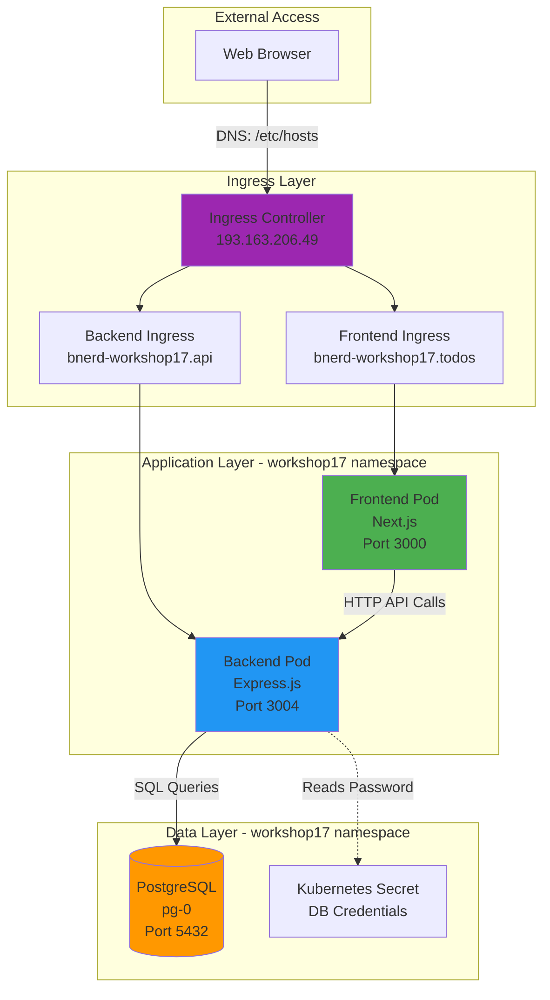
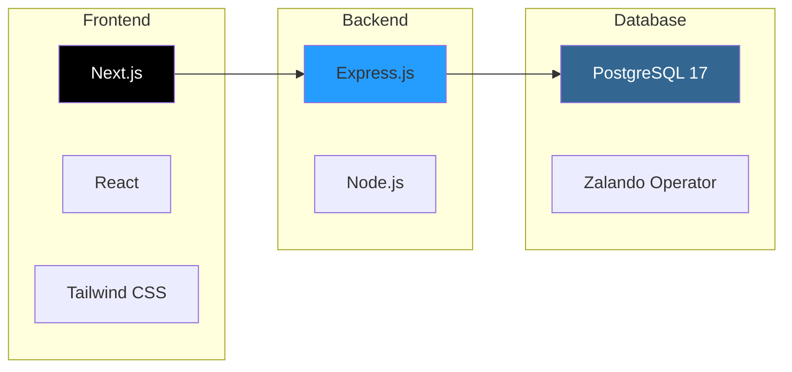
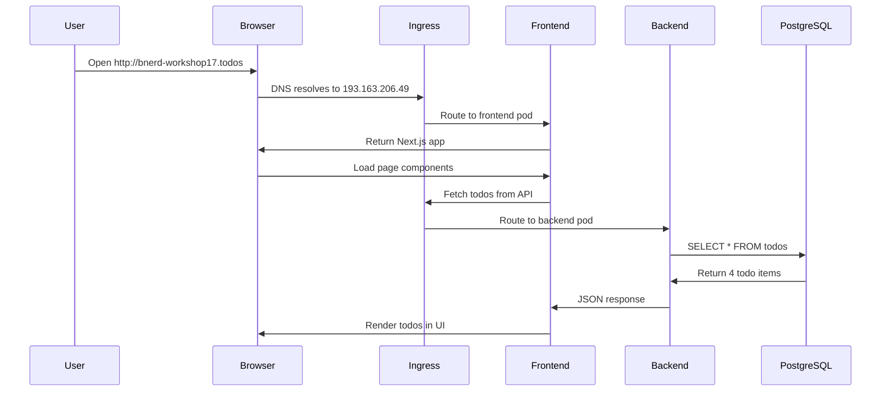

# Lab 02: Deploy with Helm - Session Summary

**Workshop**: Kubernetes Advanced (bnerd.com)
**Namespace**: `workshop17`
**Date**: 2025-11-14
**Status**: ✅ **COMPLETED**

---

## Architecture Overview



---

## What Was Completed

### 1. Prerequisites Setup
- ✅ Installed Helm 4.0.0 via Homebrew
- ✅ Cloned todo-app repository from `https://git.bnerd.com/workshop-public/todo-app.git`

### 2. Backend Deployment
- ✅ Modified `infrastructure/charts/backend/values.yaml`:
  - Ingress host: `bnerd-workshop17.api`
  - Database host: `pg.workshop17.svc.cluster.local`
- ✅ Deployed via Helm: `helm upgrade --install backend . -n workshop17`
- ✅ Backend successfully connected to PostgreSQL database

### 3. Frontend Deployment
- ✅ Modified `infrastructure/charts/frontend/values.yaml`:
  - Ingress host: `bnerd-workshop17.todos`
  - API URL: `http://bnerd-workshop17.api`
- ✅ Deployed via Helm: `helm upgrade --install frontend . -n workshop17`

### 4. DNS Configuration
- ✅ Added entries to `/etc/hosts`:
  ```
  193.163.206.49 bnerd-workshop17.todos bnerd-workshop17.api
  ```

### 5. Verification
- ✅ Frontend accessible at http://bnerd-workshop17.todos
- ✅ Backend API accessible at http://bnerd-workshop17.api
- ✅ Backend successfully fetching todos from database

---

## Current Cluster State

### Deployed Resources

| Resource Type | Name | Status | Description |
|--------------|------|--------|-------------|
| **Helm Release** | `backend` | Deployed | Backend API application |
| **Helm Release** | `frontend` | Deployed | Frontend web application |
| **Pod** | `backend-b8c49fb77-mvczd` | Running | Express.js backend server |
| **Pod** | `frontend-54b7c766d4-n6rq5` | Running | Next.js frontend server |
| **Pod** | `pg-0` | Running | PostgreSQL database (Lab 01) |
| **Service** | `backend` | ClusterIP | Backend service (port 3004) |
| **Service** | `frontend` | ClusterIP | Frontend service (port 3000) |
| **Ingress** | `backend` | Active | Routes traffic to backend |
| **Ingress** | `frontend` | Active | Routes traffic to frontend |

### Pod Status
```bash
NAME                        READY   STATUS      RESTARTS   AGE
backend-b8c49fb77-mvczd     1/1     Running     0          ~4m
frontend-54b7c766d4-n6rq5   1/1     Running     0          ~4m
pg-0                        1/1     Running     0          ~6h
prepare-db-dpf5z            0/1     Completed   0          ~5h
```

### Ingress Configuration

| Host | Service | Port | External IP |
|------|---------|------|-------------|
| `bnerd-workshop17.api` | backend | 3004 | 193.163.206.49 |
| `bnerd-workshop17.todos` | frontend | 3000 | 193.163.206.49 |

---

## Application Stack

### Technology Stack



| Component | Technology | Version | Port | Image |
|-----------|-----------|---------|------|-------|
| Frontend | Next.js | latest | 3000 | `vtrhh/todo-app-frontend:latest` |
| Backend | Express.js (Node.js) | latest | 3004 | `vtrhh/todo-app-backend:latest` |
| Database | PostgreSQL | 17 | 5432 | Managed by Zalando Operator |

---

## Configuration Files Modified

### Backend values.yaml
```yaml
# infrastructure/charts/backend/values.yaml

# Line 71: Ingress Host
ingress:
  hosts:
    - host: bnerd-workshop17.api  # Changed from: bnerd-<your namespace>.api

# Line 133: Database Host
database:
  secretName: postgres.pg.credentials.postgresql.acid.zalan.do
  name: todos
  host: pg.workshop17.svc.cluster.local  # Changed from: pg.<your namespace>.svc.cluster.local
```

### Frontend values.yaml
```yaml
# infrastructure/charts/frontend/values.yaml

# Line 70: Ingress Host
ingress:
  hosts:
    - host: bnerd-workshop17.todos  # Changed from: bnerd-<your namespace>.todos

# Line 130: API URL
api:
  url: http://bnerd-workshop17.api  # Changed from: http://bnerd-<your namespace>.api
```

---

## API Testing Results

### Backend API Endpoints

| Endpoint | Method | Status | Response |
|----------|--------|--------|----------|
| `/` | GET | ✅ 200 OK | "Welcome to todo backend!" |
| `/todos` | GET | ✅ 200 OK | Array of 4 todos from database |

### Sample API Response
```json
[
  {
    "id": "94cddd0d-7d5c-4087-a5d5-25eb9b84374d",
    "todo": "Finish the Next.js app",
    "completed": false
  },
  {
    "id": "ae5809f6-788e-4e8d-94e1-e05a610e3e10",
    "todo": "Read the Tailwind CSS documentation",
    "completed": true
  },
  {
    "id": "dbcf7d1e-50fd-4176-b1b5-794f19459803",
    "todo": "Learn how to use PostgreSQL",
    "completed": false
  },
  {
    "id": "0be11d01-4f5b-4063-9039-059fad73846c",
    "todo": "Deploy the app to Kubernetes",
    "completed": false
  }
]
```

---

## Useful Commands

### Helm Management
```bash
# List installed releases
helm list -n workshop17 --kubeconfig kubeconfig-workshop17.yaml

# Get release status
helm status backend -n workshop17 --kubeconfig kubeconfig-workshop17.yaml
helm status frontend -n workshop17 --kubeconfig kubeconfig-workshop17.yaml

# View release history
helm history backend -n workshop17 --kubeconfig kubeconfig-workshop17.yaml

# Upgrade releases (after values.yaml changes)
helm upgrade backend ./infrastructure/charts/backend -n workshop17 --kubeconfig kubeconfig-workshop17.yaml
helm upgrade frontend ./infrastructure/charts/frontend -n workshop17 --kubeconfig kubeconfig-workshop17.yaml
```

### Application Access
```bash
# Test backend API
curl http://bnerd-workshop17.api
curl http://bnerd-workshop17.api/todos

# Test frontend
curl http://bnerd-workshop17.todos

# Open in browser
open http://bnerd-workshop17.todos
open http://bnerd-workshop17.api/todos
```

### Troubleshooting
```bash
# Check all pods
kubectl get pods -n workshop17 --kubeconfig kubeconfig-workshop17.yaml

# Check pod logs
kubectl logs -n workshop17 -l app.kubernetes.io/name=backend --kubeconfig kubeconfig-workshop17.yaml
kubectl logs -n workshop17 -l app.kubernetes.io/name=frontend --kubeconfig kubeconfig-workshop17.yaml

# Check ingress
kubectl get ingress -n workshop17 --kubeconfig kubeconfig-workshop17.yaml
kubectl describe ingress backend -n workshop17 --kubeconfig kubeconfig-workshop17.yaml

# Check services
kubectl get svc -n workshop17 --kubeconfig kubeconfig-workshop17.yaml

# Check ingress controller
kubectl get svc -n ingress-nginx --kubeconfig kubeconfig-workshop17.yaml
```

### Cleanup (when ready for next lab)
```bash
# Remove Helm releases
helm uninstall frontend -n workshop17 --kubeconfig kubeconfig-workshop17.yaml
helm uninstall backend -n workshop17 --kubeconfig kubeconfig-workshop17.yaml

# Verify cleanup
kubectl get all -n workshop17 --kubeconfig kubeconfig-workshop17.yaml
helm list -n workshop17 --kubeconfig kubeconfig-workshop17.yaml

# Optional: Clean /etc/hosts (manual edit)
sudo nano /etc/hosts
# Remove line: 193.163.206.49 bnerd-workshop17.todos bnerd-workshop17.api
```

---

## Data Flow



---

## Key Learnings

### Helm Benefits
- **Templating**: Reusable Kubernetes manifests with dynamic values
- **Package Management**: Install/upgrade/rollback as a single unit
- **Version Control**: Track deployment history
- **Easy Configuration**: Single `values.yaml` file for all settings

### Kubernetes Networking
- **Ingress Controller**: Single entry point for multiple services
- **DNS-based Routing**: Host-based routing to different services
- **ClusterIP Services**: Internal service discovery within cluster
- **DNS Resolution**: Kubernetes internal DNS (e.g., `pg.workshop17.svc.cluster.local`)

### Application Architecture
- **Separation of Concerns**: Frontend, Backend, Database as separate components
- **Service Discovery**: Backend finds database via Kubernetes DNS
- **Secret Management**: Database credentials stored in Kubernetes secrets
- **Health Checks**: Liveness and readiness probes ensure pod health

---

## Next Steps

According to the workshop at https://kubernetes-advanced.bnerd.com/:

### Before Lab 03
**Cleanup Required**: Yes, the workshop asks to clean up before continuing
```bash
helm uninstall frontend -n workshop17
helm uninstall backend -n workshop17
```

### Upcoming Labs
1. **Lab 03**: Advanced Kubernetes topics (to be determined)
2. **Lab 04+**: Additional advanced topics

**Note**: The PostgreSQL database from Lab 01 should remain running as it will likely be needed for future labs.

---

## Workshop Links

- **Workshop Home**: https://kubernetes-advanced.bnerd.com/
- **Lab 01 (DB Setup)**: https://kubernetes-advanced.bnerd.com/01_db-setup/
- **Lab 02 (Helm Deploy)**: https://kubernetes-advanced.bnerd.com/02_deploy-with-helm/
- **Lab 03 (Next)**: https://kubernetes-advanced.bnerd.com/03_*/

---

## Repository Structure

```
todo-app/
├── backend/                    # Backend source code
│   ├── index.js               # Express.js server
│   ├── package.json
│   └── Dockerfile
├── frontend/                   # Frontend source code
│   ├── src/
│   ├── package.json
│   └── Dockerfile
└── infrastructure/
    └── charts/
        ├── backend/           # Helm chart for backend
        │   ├── Chart.yaml
        │   ├── values.yaml    # ✏️ Modified
        │   └── templates/
        └── frontend/          # Helm chart for frontend
            ├── Chart.yaml
            ├── values.yaml    # ✏️ Modified
            └── templates/
```

---

## Notes

- **Kubeconfig**: `~/Developer/projects/google-events/hamburg-25/kubernetes-workshop/kubeconfig-workshop17.yaml`
- **Helm Version**: 4.0.0 (installed via Homebrew)
- **Ingress Controller**: nginx (pre-installed by workshop)
- **External IP**: 193.163.206.49
- **Workshop Namespace**: workshop17

### Environment-Specific
- This deployment uses pre-built Docker images from Docker Hub
- No custom image builds were required
- Database credentials managed automatically by Zalando Postgres Operator
