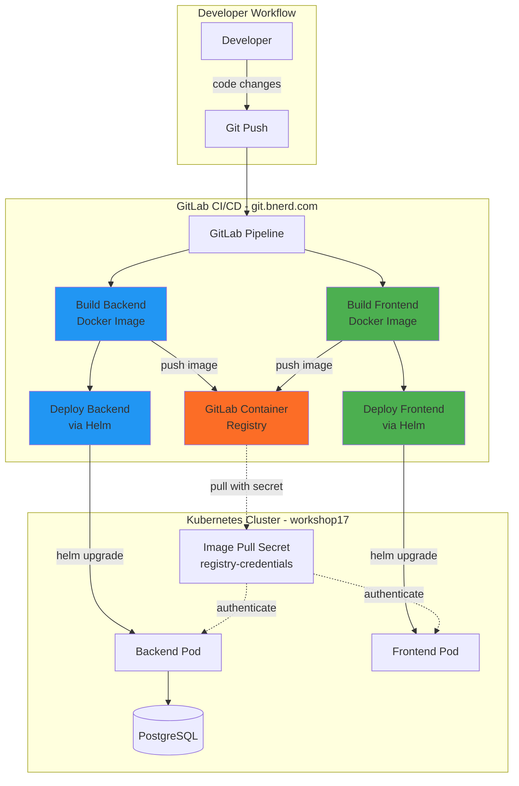
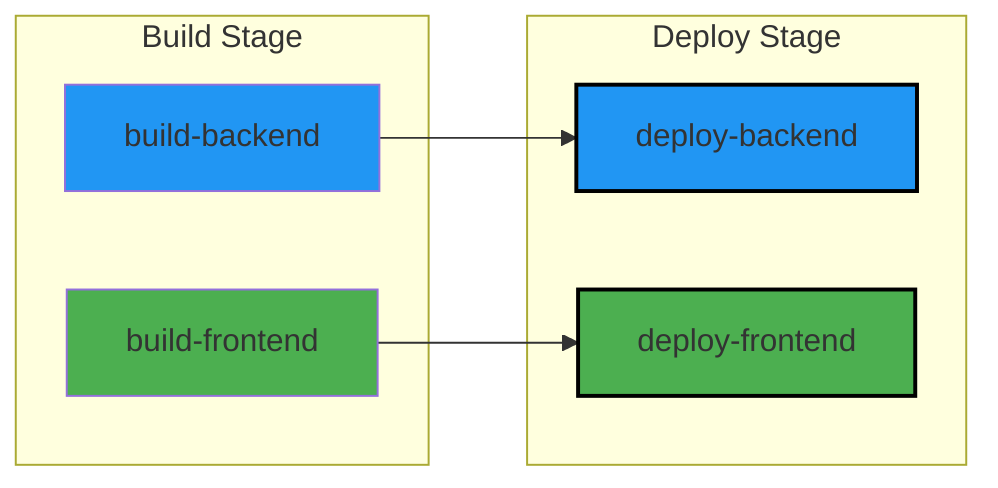
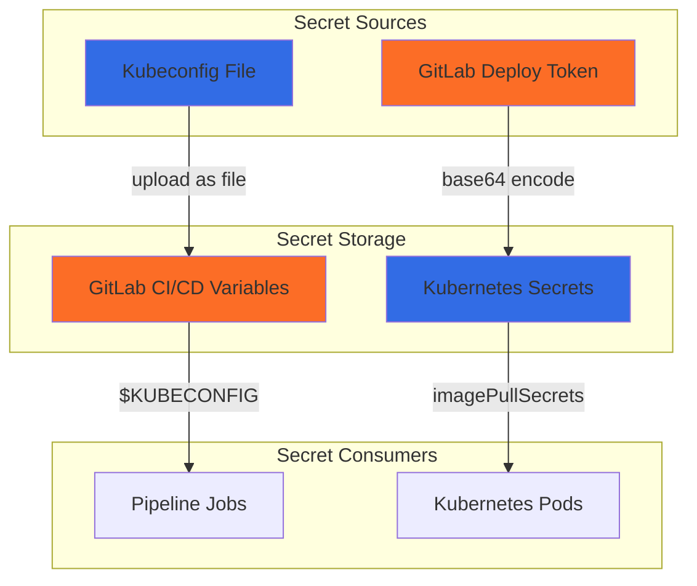
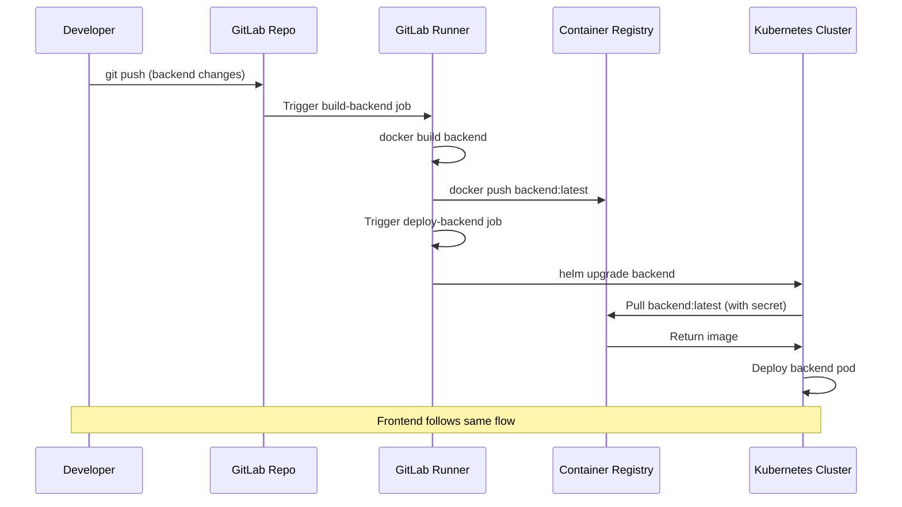

# Lab 03: GitLab CI/CD Pipeline Setup - Session Summary

**Workshop**: Kubernetes Advanced (bnerd.com)
**Namespace**: `workshop17`
**Date**: 2025-11-14
**Status**: ✅ **COMPLETED**

---

## Architecture Overview



---

## What Was Completed

### 1. GitLab Project Setup
- ✅ Created GitLab project: `todo-app-workshop17`
- ✅ Configured Git remotes (renamed `origin` to `old-origin`)
- ✅ Added new remote: `https://git.bnerd.com/workshop/todo-app-workshop17.git`
- ✅ Pushed initial code to GitLab
- ✅ Configured HTTP/1.1 for Git (to avoid HTTP/2 framing errors)

### 2. CI/CD Pipeline Implementation
- ✅ Created `.gitlab-ci.yml` with build and deploy stages
- ✅ Implemented backend Docker build job
- ✅ Implemented frontend Docker build job
- ✅ Implemented backend Helm deployment job
- ✅ Implemented frontend Helm deployment job

### 3. Container Registry Configuration
- ✅ Created GitLab deploy token: `gitlab+deploy-token-27`
- ✅ Generated `.dockerconfigjson` with base64-encoded credentials
- ✅ Created Kubernetes secret: `registry-credentials-workshop17`
- ✅ Updated Helm values to reference GitLab registry
- ✅ Added `.gitignore` to prevent credential leaks

### 4. Kubernetes Integration
- ✅ Added `KUBECONFIG` as GitLab CI/CD variable (File type)
- ✅ Configured Helm charts to pull from GitLab registry
- ✅ Set up imagePullSecrets in both backend and frontend charts

---

## Pipeline Configuration

### Pipeline Structure



### Pipeline Jobs

| Job | Stage | Image | Trigger Rule | Purpose |
|-----|-------|-------|--------------|---------|
| `build-backend` | build | `docker:20.10.7` | Changes in `backend/**/*` | Build backend Docker image |
| `build-frontend` | build | `docker:20.10.7` | Changes in `frontend/**/*` | Build frontend Docker image |
| `deploy-backend` | deploy | `alpine/helm:latest` | Changes in backend or charts | Deploy backend with Helm |
| `deploy-frontend` | deploy | `alpine/helm:latest` | Changes in frontend or charts | Deploy frontend with Helm |

### Build Jobs Configuration

```yaml
build-backend:
  stage: build
  image: docker:20.10.7
  services:
    - docker:20.10.7-dind
  script:
    - echo $CI_REGISTRY_PASSWORD | docker login -u $CI_REGISTRY_USER $CI_REGISTRY --password-stdin
    - docker build -t $CI_REGISTRY/workshop/todo-app-workshop17/backend:latest ./backend
    - docker push $CI_REGISTRY/workshop/todo-app-workshop17/backend:latest
  rules:
    - changes:
        - backend/**/*
```

### Deploy Jobs Configuration

```yaml
deploy-backend:
  stage: deploy
  image: alpine/helm:latest
  script:
    - helm upgrade --install backend ./infrastructure/charts/backend -n workshop17 --kubeconfig $KUBECONFIG
  rules:
    - changes:
        - backend/**/*
        - infrastructure/charts/backend/**/*
```

---

## GitLab Configuration

### Deploy Token

| Property | Value |
|----------|-------|
| **Name** | `gitlab+deploy-token-27` |
| **Username** | `gitlab+deploy-token-27` |
| **Token** | `<REDACTED - see .env GITLAB_DEPLOY_TOKEN>` |
| **Scope** | `read_registry` |
| **Purpose** | Allow Kubernetes to pull images from GitLab registry |

### CI/CD Variables

| Variable | Type | Protected | Masked | Value |
|----------|------|-----------|--------|-------|
| `KUBECONFIG` | File | ❌ No | ❌ No | workshop17 kubeconfig content |
| `CI_REGISTRY` | Built-in | - | - | `git.bnerd.com:5050` |
| `CI_REGISTRY_USER` | Built-in | - | - | `gitlab-ci-token` |
| `CI_REGISTRY_PASSWORD` | Built-in | - | ✅ Yes | Auto-generated per job |

---

## Container Registry Setup

### Image Repositories

| Component | Registry Path |
|-----------|---------------|
| Backend | `git.bnerd.com:5050/workshop/todo-app-workshop17/backend:latest` |
| Frontend | `git.bnerd.com:5050/workshop/todo-app-workshop17/frontend:latest` |

### Kubernetes Secret for Image Pulls

```yaml
apiVersion: v1
kind: Secret
metadata:
  name: registry-credentials-workshop17
  namespace: workshop17
type: kubernetes.io/dockerconfigjson
data:
  .dockerconfigjson: <base64-encoded-credentials>
```

**Created with:**
```bash
kubectl apply -f registry-credentials.yaml --kubeconfig kubeconfig-workshop17.yaml
```

---

## Helm Chart Updates

### Backend values.yaml Changes

```yaml
# Before:
image:
  repository: vtrhh/todo-app-backend
imagePullSecrets: []

# After:
image:
  repository: git.bnerd.com:5050/workshop/todo-app-workshop17/backend
imagePullSecrets:
  - name: registry-credentials-workshop17
```

### Frontend values.yaml Changes

```yaml
# Before:
image:
  repository: vtrhh/todo-app-frontend
imagePullSecrets: []

# After:
image:
  repository: git.bnerd.com:5050/workshop/todo-app-workshop17/frontend
imagePullSecrets:
  - name: registry-credentials-workshop17
```

---

## Security Configuration

### Files Added to .gitignore

```
.dockerconfigjson
registry-credentials.yaml
```

**Purpose**: Prevent accidentally committing sensitive credentials to Git

### Secret Management



---

## Git Configuration

### Remote Configuration

```bash
# Original remote
old-origin: https://git.bnerd.com/workshop-public/todo-app.git

# New remote
origin: https://git.bnerd.com/workshop/todo-app-workshop17.git
```

### Git Settings Applied

```bash
# Force HTTP/1.1 (fix for HTTP/2 errors)
git config --local http.version HTTP/1.1
```

---

## Pipeline Triggers

### When Jobs Run

| Event | Jobs Triggered |
|-------|----------------|
| Change `backend/**/*` | `build-backend` → `deploy-backend` |
| Change `frontend/**/*` | `build-frontend` → `deploy-frontend` |
| Change `infrastructure/charts/backend/**/*` | `deploy-backend` (no build) |
| Change `infrastructure/charts/frontend/**/*` | `deploy-frontend` (no build) |
| Change other files | No jobs run |

### Smart Pipeline Behavior
- **Incremental builds**: Only builds what changed
- **Dependency tracking**: Deploy jobs depend on build jobs
- **Resource efficiency**: Doesn't rebuild unnecessarily

---

## Useful Commands

### GitLab Pipeline Management

```bash
# View pipeline status (in GitLab UI)
https://git.bnerd.com/workshop/todo-app-workshop17/-/pipelines

# View container registry
https://git.bnerd.com/workshop/todo-app-workshop17/container_registry

# Trigger pipeline manually
git commit --allow-empty -m "Trigger pipeline"
git push
```

### Local Testing

```bash
# Test Helm deployment locally
helm upgrade --install backend ./infrastructure/charts/backend -n workshop17 \
  --kubeconfig kubeconfig-workshop17.yaml

# Build Docker image locally
docker build -t test-backend ./backend

# Check Kubernetes secret
kubectl get secret registry-credentials-workshop17 -n workshop17 \
  --kubeconfig kubeconfig-workshop17.yaml -o yaml
```

### Troubleshooting

```bash
# Check GitLab pipeline logs (via UI)
Project → CI/CD → Pipelines → Select job

# Verify KUBECONFIG works
kubectl get pods -n workshop17 --kubeconfig $KUBECONFIG

# Test registry authentication locally
echo "$GITLAB_DEPLOY_TOKEN" | docker login git.bnerd.com:5050 \
  -u "$GITLAB_DEPLOY_USER" --password-stdin

# Verify image pull secret
kubectl get secret registry-credentials-workshop17 -n workshop17 -o json | \
  jq -r '.data[".dockerconfigjson"]' | base64 -d
```

---

## Pipeline Flow Diagram



---

## Key Learnings

### CI/CD Concepts
- **Infrastructure as Code**: Pipeline defined in `.gitlab-ci.yml`
- **Automated Deployments**: Code changes trigger automatic builds and deploys
- **Container Registry**: Private registry for custom Docker images
- **GitOps Workflow**: Git push → Build → Deploy cycle

### Kubernetes Integration
- **Image Pull Secrets**: Authenticate to private registries
- **Service Accounts**: Kubernetes uses tokens for cluster access
- **Helm Automation**: Deploy complex applications with single commands

### Security Best Practices
- **Secret Management**: Never commit credentials to Git
- **Least Privilege**: Deploy token has read-only registry access
- **Namespace Isolation**: All resources scoped to workshop17 namespace

### Pipeline Optimization
- **Conditional Execution**: Jobs only run when relevant files change
- **Parallel Execution**: Build jobs can run simultaneously
- **Caching**: Docker layers cached between builds (via dind)

---

## Current State

### Repository Structure

```
todo-app/
├── .gitlab-ci.yml                 # ✅ CI/CD pipeline definition
├── .gitignore                     # ✅ Updated with secrets
├── .dockerconfigjson              # 🔒 Gitignored (local only)
├── registry-credentials.yaml      # 🔒 Gitignored (local only)
├── backend/
│   ├── Dockerfile                 # Used by build-backend job
│   └── ...
├── frontend/
│   ├── Dockerfile                 # Used by build-frontend job
│   └── ...
└── infrastructure/
    └── charts/
        ├── backend/
        │   └── values.yaml        # ✅ Updated for GitLab registry
        └── frontend/
            └── values.yaml        # ✅ Updated for GitLab registry
```

### GitLab Resources

| Resource | Location | Status |
|----------|----------|--------|
| Repository | `git.bnerd.com/workshop/todo-app-workshop17` | ✅ Active |
| Pipeline | CI/CD → Pipelines | ✅ Configured |
| Registry | Packages & Registries → Container Registry | ✅ Ready |
| Deploy Token | Settings → Repository → Deploy Tokens | ✅ Created |
| KUBECONFIG | Settings → CI/CD → Variables | ✅ Configured |

### Kubernetes Resources

```bash
kubectl get secret registry-credentials-workshop17 -n workshop17
# NAME                              TYPE                             DATA   AGE
# registry-credentials-workshop17   kubernetes.io/dockerconfigjson   1      ~30m
```

---

## Next Steps

### To Trigger the Pipeline

The pipeline is configured but hasn't run yet because no backend/frontend code has changed since setup. To test it:

**Option 1: Make a code change**
```bash
# Add a comment to backend code
echo "// Testing pipeline" >> backend/index.js
git add backend/index.js
git commit -m "Test pipeline trigger"
git push
```

**Option 2: Empty commit (forces pipeline)**
```bash
git commit --allow-empty -m "Trigger pipeline"
git push
```

### Expected Pipeline Behavior

1. `build-backend` and `build-frontend` jobs will run
2. Docker images will be pushed to GitLab registry
3. `deploy-backend` and `deploy-frontend` will deploy to Kubernetes
4. Pods will pull images using `registry-credentials-workshop17` secret

### Monitoring

- **Pipeline**: https://git.bnerd.com/workshop/todo-app-workshop17/-/pipelines
- **Registry**: https://git.bnerd.com/workshop/todo-app-workshop17/container_registry
- **Deployments**: `kubectl get pods -n workshop17`

---

## Upcoming Labs

According to the workshop at https://kubernetes-advanced.bnerd.com/:

### Lab 04+
- Advanced Kubernetes topics (TBD)
- Possible topics: Monitoring, logging, scaling, security

---

## Workshop Links

- **Workshop Home**: https://kubernetes-advanced.bnerd.com/
- **Lab 01 (DB Setup)**: https://kubernetes-advanced.bnerd.com/01_db-setup/
- **Lab 02 (Helm Deploy)**: https://kubernetes-advanced.bnerd.com/02_deploy-with-helm/
- **Lab 03 (GitLab Pipeline)**: https://kubernetes-advanced.bnerd.com/03_set-up-gitlab-pipeline/
- **GitLab Project**: https://git.bnerd.com/workshop/todo-app-workshop17

---

## Notes

- **Kubeconfig**: `~/Developer/projects/google-events/hamburg-25/kubernetes-workshop/kubeconfig-workshop17.yaml`
- **Workshop Namespace**: `workshop17`
- **GitLab Registry**: `git.bnerd.com:5050`
- **Deploy Token User**: `gitlab+deploy-token-27`

### Important Files (Gitignored)
- `.dockerconfigjson`: Docker config with registry credentials
- `registry-credentials.yaml`: Kubernetes secret manifest
- Both files contain sensitive credentials and must not be committed

### Git HTTP/2 Issue
If you encounter "HTTP2 framing layer" errors:
```bash
git config --local http.version HTTP/1.1
```
